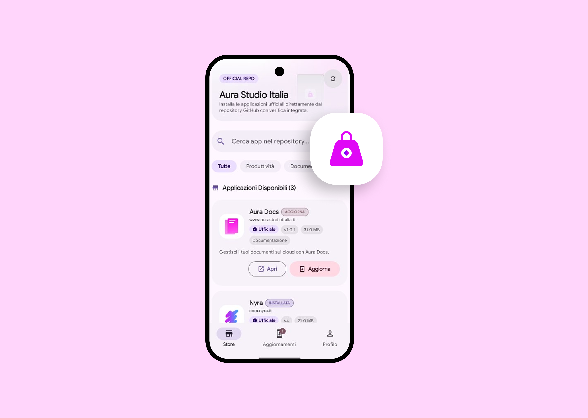

<div align="center">



# 🛍️ Aura Store

### Android App

**Installa e gestisci le app Aura, con funzionalità avanzate e repository personalizzate.**

[](https://developer.android.com)
[](https://developer.android.com/studio)
[](https://openjdk.org)
[](LICENSE)

</div>

---

## 👋 Benvenuto

Benvenuto nel repository ufficiale di **Aura Store**, un'applicazione Android per installare e gestire le altre app Aura con funzionalità avanzate (come aggiungere altre repository che seguono lo schema Aura Store), sviluppata utilizzando **Android Studio**.

---

## 📖 Descrizione

Aura Store è uno store digitale progettato per **semplificare l'installazione e la gestione** delle app Android di Aura.

> [!TIP]
> Puoi anche aggiungere **repository esterne** che seguono lo schema Aura Store.

---

## 🧰 Requisiti di Sistema

Per compilare e avviare correttamente il progetto, assicurati di avere installato:

| Strumento | Versione |
|---|---|
| 🧑‍💻 **Android Studio** | Jellyfish o superiore (consigliata) |
| ☕ **Java Development Kit (JDK)** | 17+ |
| 🤖 **Android SDK** | API Level 34 o superiore |
| 🐘 **Gradle** | 8.0+ |

---

## 🛠️ Istruzioni per la Compilazione

Segui questi passaggi per configurare l'ambiente di sviluppo e compilare l'applicazione.

### 1️⃣ Clona il repository

```bash
git clone https://github.com/AuraStudioItalia/store-android-app.git
cd store-android-app
```

### 2️⃣ Apri il progetto

1. Avvia **Android Studio**.
2. Seleziona **File > Open** e naviga fino alla cartella del progetto clonata.
3. Attendi che **Gradle** sincronizzi le dipendenze automaticamente.

### 3️⃣ Compilazione

Dalla barra dei menu, clicca su **Build > Make Project**.

In alternativa, usa il terminale integrato:

```bash
./gradlew assembleDebug
```

### 4️⃣ Esecuzione

1. Collega il tuo dispositivo Android (con **Debug USB** abilitato) o avvia un emulatore.
2. Clicca sul pulsante **Run** (icona ▶️ verde) in Android Studio.

---

## 📁 Struttura del Progetto

```text
store-android-app/
├── app/
│   ├── src/main/
│   │   ├── java/      # Codice sorgente (Kotlin/Java)
│   │   └── res/       # Risorse (layout XML, immagini, icone)
│   └── build.gradle   # Configurazione delle dipendenze e build
└── LICENSE
```

---

## 📜 Licenza

Questo progetto è rilasciato sotto licenza **AGPL**. Consulta il file [`LICENSE`](LICENSE) per ulteriori dettagli.
